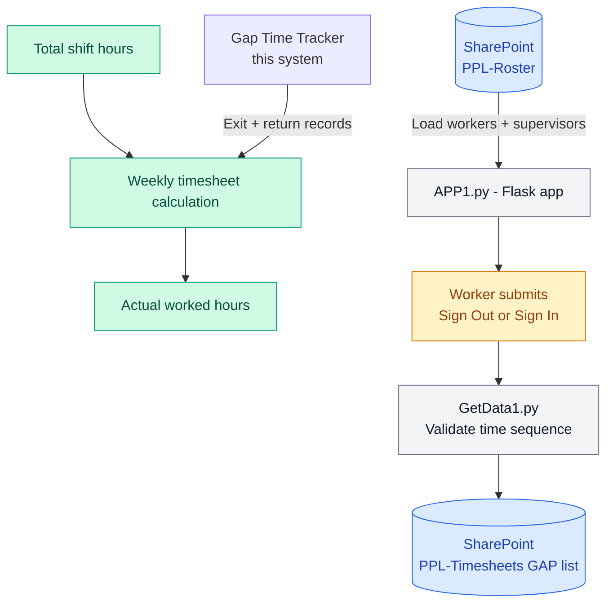

# Marlu Weekly Timesheet — Gap Time Tracker

Records worker exit and return times during a shift. Gap time is later subtracted from total shift hours to calculate actual worked hours in the weekly timesheet.

## How gap time fits into the timesheet



## Sign Out / Sign In logic

Each worker can exit and return multiple times per shift. The system enforces strict time ordering:

| Scenario | Behaviour |
|---|---|
| No record today | Create first Sign Out record |
| Latest = Sign In | Create Sign Out — time must be after last Sign In |
| Latest = Sign Out | Must provide missing Sign In time first, then create new Sign Out |
| Sign In with no prior record today | Create Sign In record |
| Latest = Sign Out | Create Sign In — time must be after last Sign Out |
| Latest = Sign In | Must provide missing Sign Out time first, then create new Sign In |

Custom time entry is supported to backfill missed records.

## Worker data rules

Workers are loaded from SharePoint `PPL-Roster` and filtered before display:

- Names containing numbers are excluded (vehicles/equipment)
- Names matching vehicle keywords are excluded (`truck`, `hilux`, `ute`, `plant` etc.)
- Supervisors identified by position keywords: `manager`, `director`, `supervisor`, `superintendent`
- Deduplicated by OPMS ID — latest record kept per person

## Technologies

- Python / Flask
- Microsoft Graph API (SharePoint read/write)
- Azure App Service
- GitHub Actions (CI/CD)
- Perth timezone aware (`Australia/Perth`)

```
## Project Structure
marlu_weeklytimesheet_automation_form_repo1/
├── APP1.py         Flask app — routes, worker/supervisor cache, API endpoints
├── GetData1.py     SharePoint read/write, sign in/out logic, time validation
├── templates/      HTML form
├── requirements.txt
└── .github/workflows/   Azure App Service deployment
```

## API Endpoints

| Endpoint | Method | Description |
|---|---|---|
| `/` | GET | Load form with worker list |
| `/api/workers` | GET | Return all workers from cache |
| `/api/supervisors` | GET | Return supervisor candidates from cache |
| `/api/status/<opms>` | GET | Get latest today record for a worker |
| `/api/sign-out` | POST | Record a Sign Out (exit) |
| `/api/sign-in` | POST | Record a Sign In (return) |
| `/api/refresh-cache` | POST | Force reload workers from SharePoint |

## Environment Variables

| Variable | Description |
|---|---|
| `SHAREPOINT_TENANT_ID` | Azure AD tenant ID |
| `SHAREPOINT_CLIENT_ID` | Azure AD app client ID |
| `SHAREPOINT_CLIENT_SECRET` | Azure AD app client secret |
| `SHAREPOINT_HOST` | SharePoint host |
| `SITE_NAME` | SharePoint site name |
| `LIST_NAME` | Roster list name |
| `GAP_LIST_NAME` | Gap timesheet list name |

## Related

Weekly Timesheet Calculator — uses the gap records from this system subtracted from total shift hours to produce final worked hours per worker.
